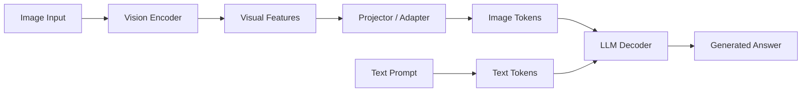

# VLM Evaluation Lab

## 1. 项目简介

`vlm-evaluation-lab` 是一个面向 Vision-Language Model（VLM）的入门级评估项目。

本项目的目标不是简单体验模型 demo，而是完整走通一次小型 VLM evaluation 闭环：

```text
数据构造 → 模型推理 → 结果记录 → 人工评分 → 错误分析 → 模型对比 → 项目报告
```

当前项目已完成对两个开源 VLM 的推理、评分和对比分析：

```text
Qwen/Qwen2.5-VL-3B-Instruct
OpenGVLab/InternVL3-2B-hf
```

通过这个项目，我希望从“知道 Qwen-VL、InternVL、LLaVA 这些模型名字”，进一步过渡到“能够实际运行 VLM，构造测试集，记录模型输出，设计评分标准，并分析不同模型在多模态任务上的表现差异”。

---

## 2. 当前完成状态

| 模块 | 状态 |
|---|---|
| 自建 VLM benchmark | 已完成 |
| Qwen2.5-VL 推理 | 已完成 |
| InternVL3-2B 推理 | 已完成 |
| 人工评分标准 rubric | 已完成 |
| Qwen 人工评分 | 已完成 |
| InternVL 人工评分 | 已完成 |
| Qwen 单模型错误分析 | 已完成 |
| 双模型对比分析 | 已完成 |
| VLMEvalKit 流程学习 | 已完成 |
| VLM 核心概念整理 | 已完成 |
| 最终项目报告 | 已完成 |
| Prompt sensitivity 实验 | 暂未系统完成，作为后续 optional |

---

## 3. Benchmark 设计

当前 benchmark 包含：

```text
40 张图像
40 个图像问答问题
每张图像 1 个问题
```

图像类型覆盖：

| 图像类型 | 测试目的 |
|---|---|
| 架构图 / 论文图 | 测试 scientific figure understanding |
| 折线图 / 柱状图 / 散点图 | 测试 chart understanding |
| 表格 / benchmark 表 | 测试 table understanding |
| OCR 文档 / 论文 / 代码截图 | 测试文字识别能力 |
| UI / 网页 / 软件截图 | 测试界面理解能力 |
| 现实场景 / 海报图片 | 测试普通视觉描述、物体识别和场景 OCR |
| No-answer 问题 | 测试 hallucination risk |

核心数据文件：

```text
data/questions.csv
data/dataset_card.md
data/images/
```

---

## 4. 评估模型

### 4.1 Qwen2.5-VL

本项目的主模型：

```text
Qwen/Qwen2.5-VL-3B-Instruct
```

选择原因：

- 当前较有代表性的开源 VLM；
- 对中文 prompt 友好；
- 具备 OCR、图表理解、表格理解、UI 截图理解和普通视觉问答能力；
- 适合作为本项目的主评估模型。

### 4.2 InternVL3-2B

本项目的对比模型：

```text
OpenGVLab/InternVL3-2B-hf
```

选择原因：

- InternVL 是当前重要的开源多模态模型系列；
- 模型规模适合本地推理；
- 可以与 Qwen2.5-VL 在 OCR、图表、表格、UI 和幻觉控制任务上进行对比。

---

## 5. VLM 基本流程

本项目中采用如下 VLM 基本理解：

```text
Image → Vision Encoder → Projector / Adapter → LLM Decoder → Answer
```

也就是说，VLM 并不是让语言模型直接“看见图片”，而是先通过 Vision Encoder 提取图像特征，再通过 Projector / Adapter 将视觉特征映射到语言模型可以处理的表示空间，最后由 LLM 根据图像信息和文本 prompt 生成回答。



更多概念整理见：

```text
notes/vlm_concepts.md
```

---

## 6. 推理方式

### 6.1 Qwen2.5-VL 推理

示例命令：

```powershell
python scripts/run_qwen_vl.py `
  --questions data/questions.csv `
  --output results/qwen_vl_40_images.csv `
  --model_name Qwen/Qwen2.5-VL-3B-Instruct `
  --prompt_mode structured_zh
```

### 6.2 InternVL3-2B 推理

示例命令：

```powershell
python scripts/run_internvl.py `
  --questions data/questions.csv `
  --output results/internvl3_2b_40_images.csv `
  --model_name OpenGVLab/InternVL3-2B-hf `
  --prompt_mode structured_zh
```

当前使用的 prompt 模式为 `structured_zh`，核心约束是：

```text
请严格基于图像内容回答问题。
不要猜测图中看不到的信息。
如果图中无法判断，请明确回答“图中无法确定”。
```

---

## 7. 人工评分方法

本项目使用 0–2 分制进行人工评分。

| 分数 | 含义 | 判断标准 |
|---:|---|---|
| 2 | 正确 | 回答与 expected_answer 一致，且能从图像中找到依据 |
| 1 | 部分正确 | 方向基本正确，但存在遗漏、轻微误读或细节错误 |
| 0 | 错误 | 答案错误、读错图像、编造信息或答非所问 |

评分标准见：

```text
evaluation/rubric.md
```

评分结果见：

```text
evaluation/manual_scores.csv
evaluation/manual_scores_internvl.csv
```

---

## 8. 实验结果概览

### 8.1 总体结果

| 模型 | 样本数 | 2 分 | 1 分 | 0 分 | 平均分 |
|---|---:|---:|---:|---:|---:|
| Qwen2.5-VL-3B-Instruct | 40 | 31 | 4 | 5 | 1.65 / 2 |
| InternVL3-2B | 40 | 31 | 4 | 5 | 1.65 / 2 |

两个模型总分相同，但错误分布不同。

### 8.2 模型对比结论

| 方向 | 初步观察 |
|---|---|
| Qwen 更稳的任务 | 表格理解、部分架构图理解、散点图参数量判断 |
| InternVL 更稳的任务 | 部分 OCR 细节、UI 快捷键读取、论文标题信息提取 |
| 两者共同难点 | 中文书法 OCR、海报标题 OCR、密集表格数值读取、复杂图表定位 |

逐样本对比结果：

| 对比结果 | 数量 |
|---|---:|
| Both correct | 28 |
| Qwen better | 4 |
| InternVL better | 4 |
| Both problematic | 4 |

详细结果见：

```text
results/model_comparison_table.csv
analysis/model_comparison.md
```

---

## 9. 错误分析总结

本项目中观察到的主要错误类型包括：

| 错误类型 | 说明 |
|---|---|
| OCR Error | 文字识别错误，例如书法、海报、小字号文本 |
| Chart Misinterpretation | 图表曲线、图例、坐标或趋势判断错误 |
| Table Misreading | 表格行列定位或数值读取错误 |
| Architecture Misreading | 架构图模块关系或流程理解错误 |
| UI Misreading | 软件界面按钮、快捷键或局部文本误读 |
| Hallucination | 编造图中没有的信息 |
| Over-general Answer | 回答过于泛泛，缺乏具体图像依据 |

代表性 hard cases：

```text
scene_02：中文书法“大音希声”识别错误
scene_07：电影海报标题识别不完整
table_06：密集 benchmark 表格数值读取错误
chart_04：复杂曲线图定位错误
architecture_03：架构图局部流程理解不准确
```

详细错误分析见：

```text
analysis/error_cases.md
```

---

## 10. VLMEvalKit 与正式评估理解

本项目后期补充学习了 VLMEvalKit 正式评估流程。

我的理解是：

```text
手动 benchmark 适合理解模型错误；
VLMEvalKit 适合标准化、大规模、可复现的模型评估。
```

二者不是替代关系，而是递进关系：

```text
先通过手动评估理解模型怎么错，
再通过正式工具理解大规模 benchmark 如何组织。
```

相关笔记见：

```text
notes/vlmevalkit_learning_notes.md
evaluation/formal_eval_vs_manual_eval.md
```

---

## 11. 项目结构

当前项目推荐结构如下：

```text
vlm-evaluation-lab/
├── README.md
├── project_plan.md
├── VLM_evaluation_report.md
├── data/
│   ├── images/
│   ├── questions.csv
│   └── dataset_card.md
├── scripts/
│   ├── run_qwen_vl.py
│   └── run_internvl.py
├── results/
│   ├── qwen_vl_40_images.csv
│   ├── internvl3_2b_40_images.csv
│   └── model_comparison_table.csv
├── evaluation/
│   ├── rubric.md
│   ├── manual_scores.csv
│   ├── manual_scores_internvl.csv
│   └── formal_eval_vs_manual_eval.md
├── analysis/
│   ├── error_cases.md
│   └── model_comparison.md
└── notes/
    ├── qwen_vl_observations.md
    ├── vlm_concepts.md
    └── vlmevalkit_learning_notes.md
```

---

## 12. 项目局限

当前项目仍然是一个小型学习型 benchmark，存在以下局限：

1. 数据规模较小，目前只有 40 张图像和 40 个问题；
2. 每张图片只有 1 个问题，尚未充分挖掘单张图片的多种能力；
3. Prompt sensitivity 没有系统展开，只在报告中做了讨论；
4. CWT / 工业图像等领域图像还不够充分；
5. 人工评分仍然带有一定主观性；
6. 当前结果不能代表模型的通用能力，只能作为项目内分析结论。

---

## 13. 后续方向

后续可以继续扩展：

```text
增加每张图像的问题数量
补充 CWT 时频图、混淆矩阵、t-SNE 等领域图像
围绕 hard cases 做轻量 prompt sensitivity 实验
尝试使用 VLMEvalKit 跑公开 mini benchmark
将当前 benchmark 转成更标准的评估格式
进一步探索 Qwen-VL / InternVL 的 LoRA 微调
```

长期路线可以是：

```text
VLM Evaluation
→ Error Analysis
→ Domain Data Construction
→ VLM Fine-tuning
→ Domain-specific VLM Evaluation
```

---

## 14. 项目意义

这个项目的价值不在于得出一个简单的模型排名，而在于完整建立了 VLM 评估意识：

```text
如何构造测试集
如何设计图像问答问题
如何保存模型输出
如何制定评分标准
如何进行人工评分
如何分析错误类型
如何比较不同模型
如何理解手动评估和正式 benchmark 的区别
```

项目完成后，可以用于：

- GitHub portfolio；
- 实习简历项目；
- 套磁邮件附件；
- 后续 VLM 微调项目的数据和评估基础；
- 后续视频多模态项目的前置能力训练。

---

## 15. 简历表述

英文版：

```text
Built a VLM evaluation lab to compare Qwen2.5-VL and InternVL3 on a self-constructed multimodal benchmark covering OCR, chart understanding, table understanding, UI screenshots, scientific figures, scene understanding, and hallucination-risk questions. Designed a 0–2 manual evaluation rubric, scored model outputs, categorized error types, and analyzed model-specific strengths and shared failure cases.
```

中文版：

```text
构建了一个小型 VLM 评估实验室，基于自建 40 图像 / 40 问题 benchmark，对 Qwen2.5-VL 和 InternVL3 进行多模态能力评估，覆盖 OCR、图表理解、表格理解、UI 截图、论文图、现实场景和幻觉风险任务。设计 0–2 分人工评分标准，完成模型输出评分、错误类型分析和双模型对比，分析不同 VLM 在细粒度视觉理解任务中的能力边界。
```
