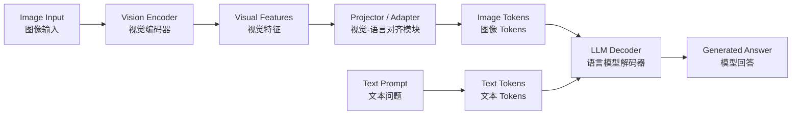

# Project Plan：VLM Evaluation Lab

## 一、项目定位

`vlm-evaluation-lab` 是一个面向 Vision-Language Model 的小型评估项目。

本项目的目标不是简单调用模型看结果，而是完整经历一次 VLM benchmark 的构建过程：

```text
明确任务 → 构造数据 → 运行模型 → 记录输出 → 人工评分 → 错误分析 → 模型比较 → 总结报告
```

通过该项目，我希望建立对 VLM 的基础理解和实践能力，为后续多模态模型微调、视频理解项目以及算法实习申请做准备。

---

## 二、项目核心问题

本项目主要回答以下问题：

1. Qwen2.5-VL 在不同视觉任务上的表现如何？
2. InternVL 或 LLaVA 与 Qwen2.5-VL 相比，各自强弱点是什么？
3. VLM 在 OCR、图表理解、表格理解、空间推理等任务中容易犯什么错误？
4. 模型是否会编造图像中不存在的信息？
5. 不同 Prompt 是否会显著影响模型回答质量？
6. 当前 VLM 是否能够理解专业领域图像，例如 CWT 时频图？

---

## 三、模型路线

### 1. 主模型

```text
Qwen2.5-VL
```

主模型优先使用：

```text
Qwen2.5-VL-3B-Instruct
```

如果显存和环境允许，再尝试：

```text
Qwen2.5-VL-7B-Instruct
```

选择 Qwen2.5-VL 的原因：

- 当前开源 VLM 中较有代表性；
- 适合处理 OCR、文档、图表、普通图像问答等任务；
- 中文和英文能力都较强；
- 适合作为后续 VLM 微调项目的基础。

---

### 2. 对比模型

优先选择：

```text
InternVL
```

备选选择：

```text
LLaVA / LLaVA-NeXT
```

选择 InternVL 的原因：

- 当前开源 MLLM 中表现较强；
- 适合与 Qwen2.5-VL 做任务维度对比；
- 对图像理解、文档理解、UI 理解等任务有较好参考价值。

选择 LLaVA 的原因：

- LLaVA 是经典视觉指令微调路线；
- 适合帮助理解早期 VLM 的基本结构和训练思想；
- 可以作为经典 baseline。

---

## 四、Benchmark 构造计划

计划构建一个约 50 张图片的小型 VLM benchmark。

每张图片设计 1–3 个问题，总问题数约 80 个。

### 图像类别设计

| 类别 | 数量 | 目的 |
|---|---:|---|
| 论文图表 | 8 | 测试 scientific figure understanding |
| 折线图 / 柱状图 | 6 | 测试 chart understanding |
| 表格 / 消融实验表 | 6 | 测试 table understanding |
| OCR 文档截图 | 6 | 测试 OCR |
| UI / 网页 / 软件截图 | 5 | 测试 UI understanding |
| 复杂现实场景 | 6 | 测试 visual description |
| 空间关系 / 计数图片 | 6 | 测试 spatial reasoning 和 counting |
| 工业图像 / CWT 时频图 | 7 | 测试 domain-specific understanding |

---

## 五、数据记录格式

后续 `data/questions.csv` 建议包含以下字段：

```text
image_id
question_id
image_path
image_type
skill_type
difficulty
question
expected_answer
answer_type
notes
```

### image_type 示例

```text
academic_figure
chart
table
ocr_document
ui_screenshot
real_world_scene
spatial_counting
industrial_cwt
```

### skill_type 示例

```text
OCR
chart_understanding
table_understanding
scientific_figure
spatial_reasoning
counting
visual_description
UI_understanding
domain_specific
hallucination_risk
```

### answer_type 示例

```text
short_text
number
yes_no
option
free_form_summary
evidence_based_reasoning
no_answer
```

---

## 六、推理结果记录格式

后续 `results/qwen_vl_outputs.csv` 和 `results/model2_outputs.csv` 建议包含：

```text
image_id
question_id
image_type
skill_type
question
model_name
model_answer
inference_time
prompt_type
language
error_note
whether_answer_is_usable
```

这样后续可以方便做模型对比和错误统计。

---

## 七、评估方法

本项目采用人工小型 benchmark 评估，而不是一开始直接依赖大型公开评测工具。

### 评分标准

采用 0–2 分制：

| 分数 | 含义 |
|---:|---|
| 2 | 完全正确，且有清晰图像依据 |
| 1 | 部分正确，但有遗漏、轻微错误或表达不够准确 |
| 0 | 错误、幻觉、答非所问或没有基于图像回答 |

---

## 八、错误类型分类

后续分析中，将重点记录以下错误类型：

| 错误类型 | 含义 |
|---|---|
| OCR Error | 文字识别错误 |
| Number Error | 数字、坐标、比例读取错误 |
| Chart Misinterpretation | 图表趋势或含义理解错误 |
| Table Misreading | 表格行列关系理解错误 |
| Object Error | 物体识别错误 |
| Spatial Error | 空间关系判断错误 |
| Counting Error | 数量判断错误 |
| Hallucination | 编造图中不存在的内容 |
| Over-general Answer | 回答过于泛泛，不够具体 |
| Reasoning Error | 看到了信息，但推理错误 |
| Format Error | 没有按照 Prompt 要求输出 |

---

## 九、Prompt 敏感性实验

选择部分图片测试不同 Prompt 对模型表现的影响。

计划使用三类 Prompt：

### Prompt 1：直接提问

```text
What is shown in this image?
```

### Prompt 2：基于可见证据回答

```text
Answer the question based only on visible evidence in the image. Do not guess.
```

### Prompt 3：结构化输出

```text
Please answer in the following format:

Observation:
Reasoning:
Final Answer:
```

观察重点：

1. 哪种 Prompt 更少幻觉；
2. 哪种 Prompt 更适合图表理解；
3. 哪种 Prompt 更适合 OCR；
4. 结构化 Prompt 是否真的提高回答质量；
5. 模型是否因为 Prompt 改变而改变事实判断。

---

## 十、VLM 基础 Pipeline

本项目中先采用如下基础理解：

```text
Image → Vision Encoder → Projector / Adapter → LLM Decoder → Answer
```

流程解释：

1. 输入图片；
2. Vision Encoder 提取图像特征；
3. Projector / Adapter 将视觉特征映射到语言模型可理解的空间；
4. 视觉信息被表示为 Image Tokens；
5. LLM Decoder 同时接收 Image Tokens 和 Text Tokens；
6. 模型生成最终自然语言回答。

---

## 十一、最终交付目标

项目最终应形成以下成果：

```text
README.md
project_plan.md
data/questions.csv
results/qwen_vl_outputs.csv
results/model2_outputs.csv
evaluation/rubric.md
evaluation/manual_scores.csv
analysis/error_cases.md
analysis/model_comparison.md
analysis/prompt_sensitivity_notes.md
notes/vlm_concepts.md
VLM_evaluation_report.md
```

最终项目可以总结为：

> Built a VLM evaluation lab for comparing Qwen2.5-VL and InternVL/LLaVA on a self-constructed multimodal benchmark covering OCR, chart understanding, table reasoning, spatial reasoning, UI screenshots, scientific figures, and domain-specific images. Conducted prompt sensitivity analysis and categorized model failure cases.


